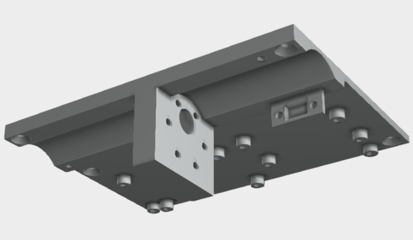
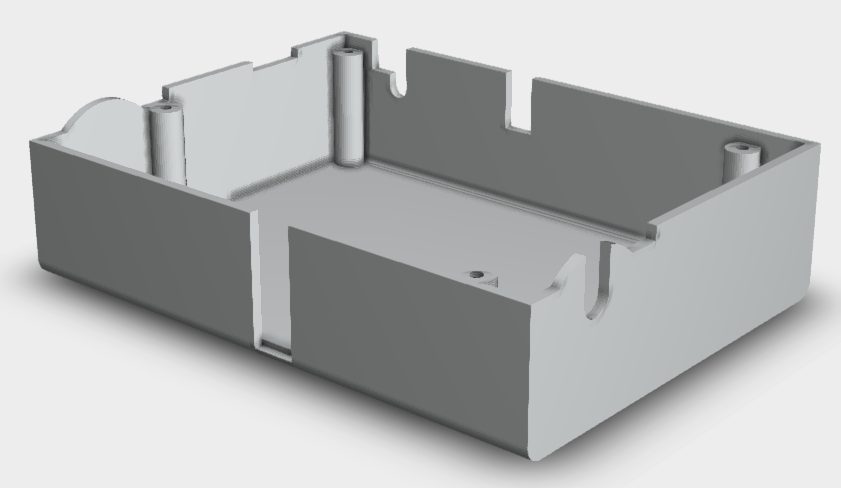

# ESP8266-Ikea-Skarsta-Trotten-Web-Dashboard

Web Dashboard for controlling a Ikea Skarsta/Trotten table which comes from the factory with manual height adjustment.

The hardware selection and 3D models of this project are mainly based on the [Instructable](https://www.instructables.com/Motorizing-an-IKEA-SKARSTA-Table/) of user pashiran. In comparison this project uses a website ("web dashboard") for controlling the table height. There are no hardware switches, just the website which can be accessed via the hosted ESP8266 server (which shall be in the same network as your clients).

## Showcase
TBD

## Circuit
TBD

## 3D Model
As previously mentioned, the [3D models](#credits) of user pashiran were used in this project.
Small holes were drilled into the table in order to screwing the `Body1.stl` with M3 screws to it. After installing `Body1.stl`, the  `Body3.stl` (case) was screwed on to it.  Some M3 insert nuts were installed to `Body1.stl` with a soldering iron.

Body1.stl ([Download](https://content.instructables.com/ORIG/FHK/3039/KJWV4CPV/FHK3039KJWV4CPV.stl)) | Body3.stl ([Download](https://content.instructables.com/ORIG/F6Q/4HMT/KJWV4CPX/F6Q4HMTKJWV4CPX.stl))
--- | ---
 | 

## Finite State Machine
The implementation is based on the following FSM:
TBD

## Dependencies
Used dependencies for this project are:
- [Arduino Library for Cytron Motor Drivers](https://github.com/CytronTechnologies/CytronMotorDriver), used to control the motor
- [HCSR04 ultrasonic sensor Library for Arduino](https://github.com/gamegine/HCSR04-ultrasonic-sensor-lib), used to read the distance from the ultrasonic sensor

The dependencies can be installed via the [standard procedure for installing Arduino libraries](https://docs.arduino.cc/software/ide-v1/tutorials/installing-libraries):

1. Open the Arduino IDE, select `Sketch` -> `Include Library` -> `Manage Libraries...`.
2. Search for `Cytron Motor Drivers Library`/`HCSR04 ultrasonic sensor Library`.
3. Click `Install` to install the library.
4. Restart the Arduino IDE.

## Hardware
- Development Board:
    - [WeMos D1 Mini Pro V 3,0 NodeMcu 4MB/16MB ESP8266 CH340G Nodemcu V2](https://de.aliexpress.com/item/32831353752.html?gatewayAdapt=glo2deu&spm=a2g0o.order_list.0.0.21ef5c5fNLvT1b)
- Motor:
    - [Bringsmart 37GB555 DC 12 V 72 RPM](https://de.aliexpress.com/item/32968002582.html?gatewayAdapt=glo2deu&s...)
- Motor Driver Board:
    - [Cytron MD10C 10Amp 5V-30V DC Motor Driver](https://www.cytron.io/p-10amp-5v-30v-dc-motor-driver)
- Shaft Coupling (6x7mm):
    - [D19L25 6x7mm](https://de.aliexpress.com/item/32874492868.html?gatewayAdapt=glo2deu&spm=a2g0o.order_list.0.0.21ef5c5fNLvT1b)
- 6mm hex wrench (cut the bent part)
- Ultrasonic Sensor:
    - [HC-SR04 Ultrasonic Sensor](https://de.aliexpress.com/item/32713522570.html?spm=a2g0o.productlist.0.0.58c243e2we2vYW&algo_pvid=2e213689-3fc1-4270-987c-e4d37fbf131a&algo_exp_id=2e213689-3fc1-4270-987c-e4d37fbf131a-0&pdp_ext_f=%7B%22sku_id%22%3A%2210000002708227828%22%7D&pdp_pi=-1%3B1.17%3B-1%3B-1%40salePrice%3BEUR%3Bsearch-mainSearch)
- [3D Print](#credits)
- Table
    - [Ikea Skarsta/Trotten](https://www.ikea.com/nl/nl/p/skarsta-trotten-bureau-zit-sta-beige-wit-s29477959/)

Total costs approx. 48 € if you are patient enough to wait for the Aliexpress delivieries from China. The table and 3D printed model are not included in my calculation.

## Credits
- [3D design files](https://www.instructables.com/Motorizing-an-IKEA-SKARSTA-Table/) by user pashiran
