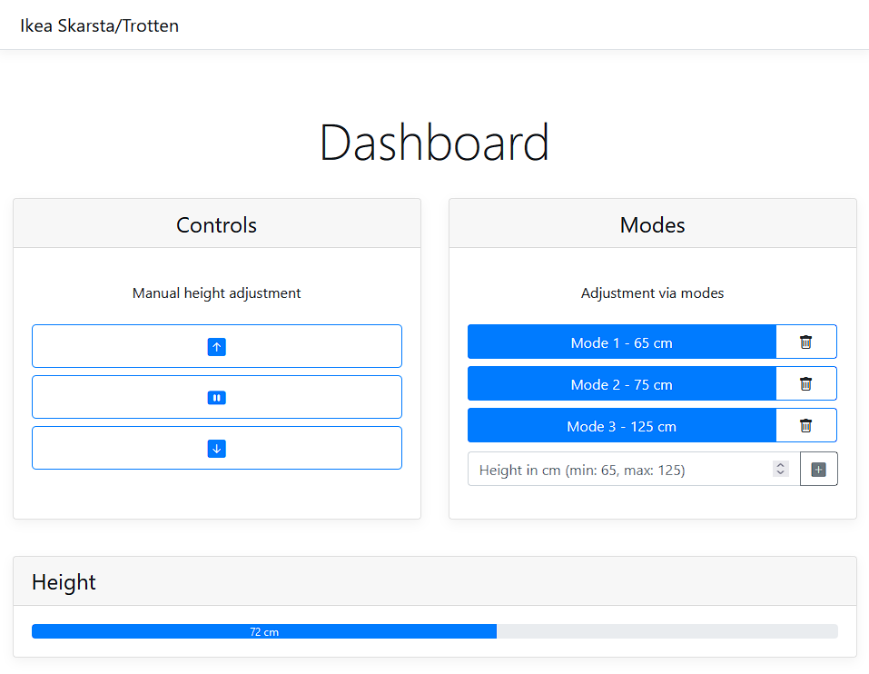
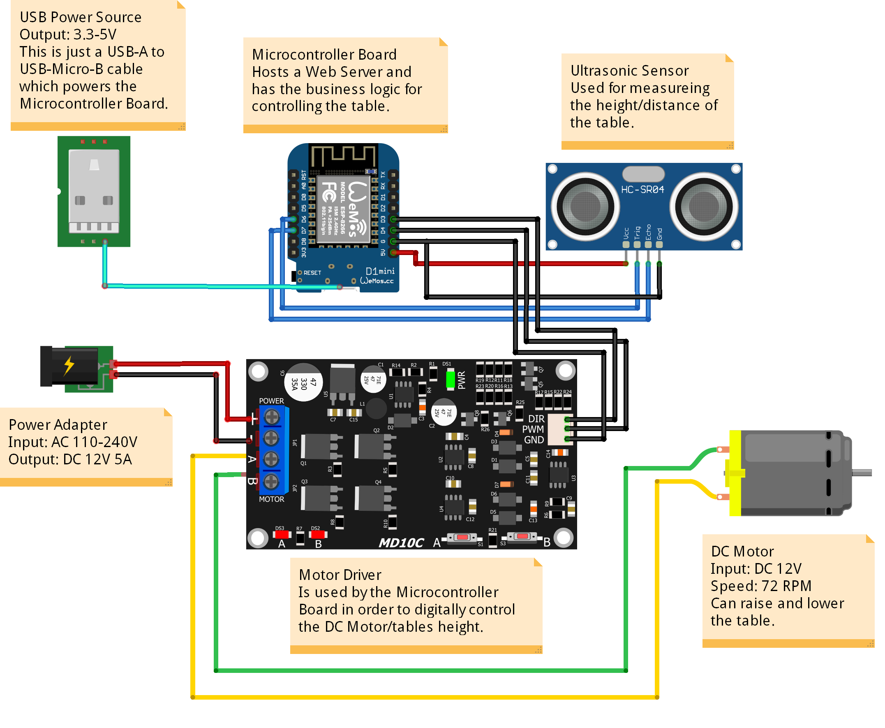
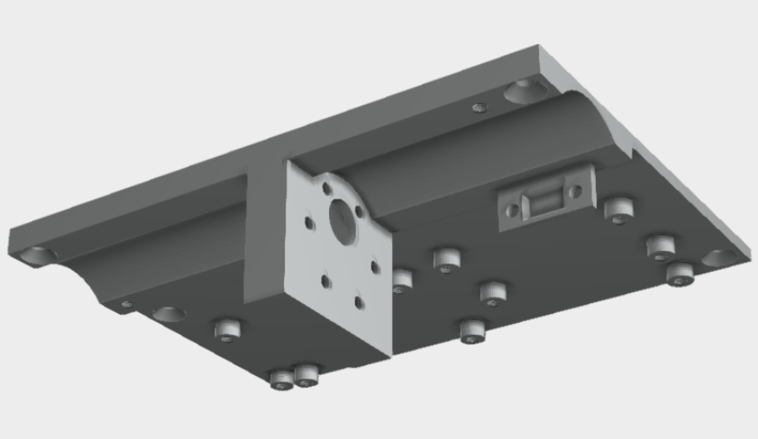
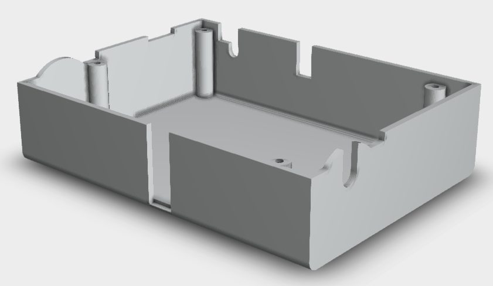
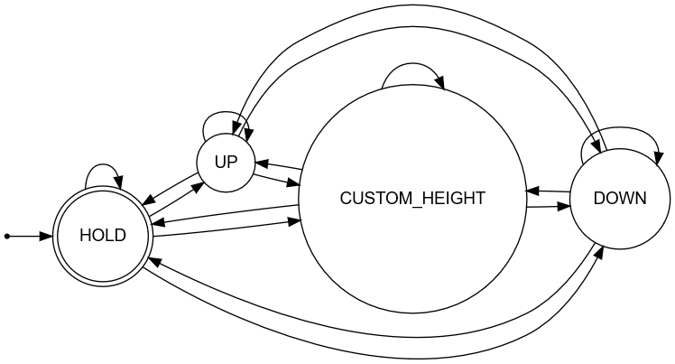

# ESP8266-Ikea-Skarsta-Trotten-Web-Dashboard

ESP8266 project for adjusting the height of an Ikea Skarsta/Trotten table via a Web Dashboard.

The table only comes with a crank from the factory - this project replaces the manual crank with a motor so there is no more need for manual cranking. This project aims to show you how to digitize an Ikea table.

## Showcase

## Features

- Web Dashboard is accessible from anywhere within your WiFi network
- No more manual cranking the table up or down
- Controlling the height of the table via the web
- Setting custom height modes via the web
- Current height is being frequently displayed

## Circuit

This circuit ([source file](res/circuit.fzz)) was designed with [Fritzing](https://fritzing.org/). Please see the hardware section near the end of the README for a detailed list of the used hardware components which are shown in the circuit.

## 3D Model

The [3D models](#credits) of user pashiran were used and adapted in this project.
Small holes were drilled into the table in order to screw the `Body1.stl` with M3 screws to it. After installing `Body1.stl`, the  `Body3.stl` (case) was screwed on to it.  Some M3 insert nuts were installed to `Body1.stl` with a soldering iron.

Body1.stl ([Download](https://content.instructables.com/ORIG/FHK/3039/KJWV4CPV/FHK3039KJWV4CPV.stl)) | Body3.stl ([Download](https://content.instructables.com/ORIG/F6Q/4HMT/KJWV4CPX/F6Q4HMTKJWV4CPX.stl))
--- | ---
 | 

## Finite State Machine

The implementation is based on the following FSM:

State transitions to the current state i.e. `UP`->`UP` happen when the user requests nothing after requesting the table to go up. The implementation takes care of stopping if the user hasn't stopped the table manually before reaching the maximum height and vice versa. `CUSTOM_HEIGHT` automatically transitions to `HOLD` whenever the requested height has been reached.
All other state transitions are done when the user requests something via the Web Dashboard through the following routes:

- `/motor/<string: action>/` with `action` being `up`, `down`, `stop`
- `/height/<string: height_in_cm>/` with `height_in_cm` in the range from `60` to `160`.

## Dependencies

Used dependencies for this project are:

- [Arduino Library for Cytron Motor Drivers](https://github.com/CytronTechnologies/CytronMotorDriver), used to control the motor
- [HCSR04 ultrasonic sensor Library for Arduino](https://github.com/gamegine/HCSR04-ultrasonic-sensor-lib), used to read the distance from the ultrasonic sensor

The dependencies can be installed via the [standard procedure for installing Arduino libraries](https://docs.arduino.cc/software/ide-v1/tutorials/installing-libraries):

1. Open the Arduino IDE, select `Sketch` -> `Include Library` -> `Manage Libraries...`.
2. Search for `Cytron Motor Drivers Library by Cytron Technologies Sdn Bhd`/`HCSR04 ultrasonic sensor Library by gamegine`.
3. Click `Install` to install the library.
4. Restart the Arduino IDE.

## Hardware

The hardware selection and 3D models of this project are mainly based on the [Instructable](https://www.instructables.com/Motorizing-an-IKEA-SKARSTA-Table/) of user pashiran. In comparison, this project uses a website ("web dashboard") for controlling the table height and a ultrasonic sensor for measuring the height instead of an optical endstop. There are no hardware switches, just the website which can be accessed via the hosted ESP8266 server (which shall be in the same network as your clients).

- Development Board:
  - [WeMos D1 Mini Pro V 3,0 NodeMcu 4MB/16MB ESP8266 CH340G Nodemcu V2](https://de.aliexpress.com/item/32831353752.html?gatewayAdapt=glo2deu&spm=a2g0o.order_list.0.0.21ef5c5fNLvT1b)
- Motor:
  - [Bringsmart 37GB555 DC 12 V 72 RPM](https://de.aliexpress.com/item/32968002582.html?gatewayAdapt=glo2deu&s...)
- Motor Driver Board:
  - [Cytron MD10C 10Amp 5V-30V DC Motor Driver](https://www.cytron.io/p-10amp-5v-30v-dc-motor-driver)
- Power Adapter
  - [Arote LED Trafo with 5.5x2.1mm Female Terminal Block 2 pin, Output: 12V 5A, Input: AC110-240V, 60W:](https://www.amazon.de/Netzteil-Netzadapter-Transformator-Kaltger%C3%A4testecker-Streifen/dp/B07FNMKTBL/ref=sr_1_11?__mk_de_DE=%C3%85M%C3%85%C5%BD%C3%95%C3%91&crid=233AIX93POJ85&keywords=12v+5a+ledmo&qid=1650661898&s=lighting&sprefix=12v+5a+ledmo%2Clighting%2C62&sr=1-11)
- Shaft Coupling (6x7mm):
  - [D19L25 6x7mm](https://de.aliexpress.com/item/32874492868.html?gatewayAdapt=glo2deu&spm=a2g0o.order_list.0.0.21ef5c5fNLvT1b)
- 6mm hex wrench (cut the bent part)
- Ultrasonic Sensor:
  - [HC-SR04 Ultrasonic Sensor](https://de.aliexpress.com/item/32713522570.html?spm=a2g0o.productlist.0.0.58c243e2we2vYW&algo_pvid=2e213689-3fc1-4270-987c-e4d37fbf131a&algo_exp_id=2e213689-3fc1-4270-987c-e4d37fbf131a-0&pdp_ext_f=%7B%22sku_id%22%3A%2210000002708227828%22%7D&pdp_pi=-1%3B1.17%3B-1%3B-1%40salePrice%3BEUR%3Bsearch-mainSearch)
- [3D Print](#credits)
- Table
  - [Ikea Skarsta/Trotten](https://www.ikea.com/nl/nl/p/skarsta-trotten-bureau-zit-sta-beige-wit-s29477959/)

Total costs approx. 48 € if you are patient enough to wait for the Aliexpress delivieries from China. The table and 3D printed model are not included in my calculation.

## Credits

- [3D design files](https://www.instructables.com/Motorizing-an-IKEA-SKARSTA-Table/) by user pashiran
- [Arduino library for HCSR04 ultrasonic sensor](https://github.com/gamegine/HCSR04-ultrasonic-sensor-lib) by gamegine
- [Arduino library for Cytron Motor Drivers](https://github.com/CytronTechnologies/CytronMotorDriver) by Cytron
- [Arduino ESP8266 Web Server library](https://github.com/esp8266/Arduino/tree/master/libraries/ESP8266WebServer) by Arduino
- [Bootstrap HTML, CSS, JS Framework](https://getbootstrap.com/) by Bootstrap
